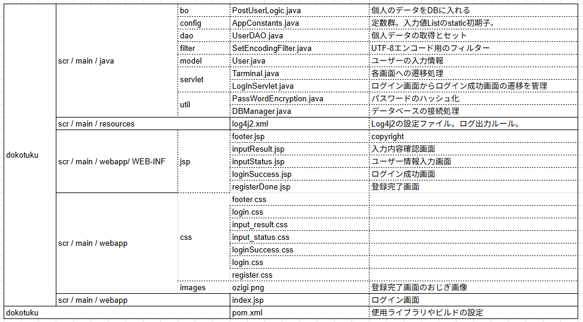

# 🌐 Webアプリケーション開発ポートフォリオ（Java / JSP / Servlet）

## 📘 概要
Java / JSP / Servlet / SQL を用いて開発した Web アプリケーションです。  
ユーザー管理・データ登録・MVC 設計と DB 連携を学習目的で作成しました。

---

## 🛠 開発環境
| 項目 | 内容 |
|------|------|
| 言語 | Java（JDK 21 など） |
| フレームワーク | Servlet / JSP（Jakarta EE） |
| データベース | H2DB 2.2.224 |
| ビルドツール | Apache Maven|
| アプリケーションサーバー | Apache Tomcat 10.x |
| IDE | Eclipse  |
| バージョン管理 | Git / GitHub |
| OS | Windows |

---

## 🧩 機能一覧
| カテゴリ | 内容 |
|------------|------|
| ユーザー管理 | 新規登録・ログイン・ログアウト |
| データベース周り | MavenによるH2DB自動インストール・HikariCPを使ったコネクションプーリング
| データ登録 | フォーム入力によるデータ追加・バリデーション処理・パスワード暗号化（bcrypt使用）|
| データ照合 | メールアドレスと復号化したパスワードによるユーザ照合|
| エラーハンドリング | 例外処理／404ページ／入力エラーメッセージ表示 |

---

## 📂 ディレクトリ構成

---
## 🗄 画面遷移
### 📘 遷移図

### テーブル定義例：users
| カラム名 | 型 | 説明 |
|-----------|----|------|
| id | INT | 主キー（AUTO_INCREMENT） |
| last_name | VARCHAR(100) | 姓 |
| first_name | VARCHAR(100) | 名 |
| last_furigana | VARCHAR(100) | 姓（カナ） |
| first_furigana | VARCHAR(100) | 名（カナ） |
| gender | VARCHAR(10) | 性別 |
| birth | DATE | 生年月日 |
| phone01 | VARCHAR(20) | 電話番号1 |
| phone02 | VARCHAR(20) | 電話番号2 |
| phone03 | VARCHAR(20) | 電話番号3 |
| zip01 | VARCHAR(10) | 郵便番号1 |
| zip02 | VARCHAR(10) | 郵便番号2 |
| adress | VARCHAR(255) | 住所 |
| email | VARCHAR(255) | メールアドレス |
| password | VARCHAR(255) | ハッシュ化されたパスワード |

---

## 🧠 設計方針・工夫点
- MVC設計：Servlet（Controller）、DAO（Model）、JSP（View）を分離
- SQLインジェクション対策として **PreparedStatement** を使用
- パスワードは **ハッシュ化（bcrypt）** して保存
- JSP include によるヘッダー・フッターの共通化

## 💬 使用技術のポイント
- **Servlet & JSP**：HTTPリクエスト処理・セッション管理・リダイレクト制御  
- **DAOパターン**：DB操作の共通化・保守性向上  
- **SQL**：CRUD・JOIN・トランザクション  
- **HTML/CSS**：UI / フォーム入力補助  
- **Tomcat**：WARデプロイ・ローカルテスト環境構築  

---

## 🧭 今後の拡張予定
- 入室時間と退出時間の入力画面とDB化

## 🧾 ライセンス・著作権
このプロジェクトは学習目的で作成したものであり、商用利用は想定していません。  
各種ライブラリ・ツールのライセンスはそれぞれの作者に帰属します。

---

## 👤 作成者
- **氏名（またはGitHubアカウント）**：ueda kiyotaka
- **開発期間**：2025年11月〜11月  
- **連絡先**：your-email@example.com  
- **GitHub**：https://github.com/TengouIwaharu722/InputStatus.git

---

## ✅ 最終更新日
2025-11-11

---

> ✏️ **編集方法**：VS Code / Typora などの Markdown 対応エディタで開くと、見出しや画像をプレビューできます。
